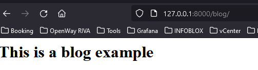

### Creating a blog.

The framework consists of several components and here we will walk through how you can get started with it.

First create our project with the **craft new** command.

First we need to create our controller with the **python craft controller Blog** this will create a new file under **app/http/controllers** called **BlogController.py**. We need to override the **show** function that must return a view.

In order to do that we have to create the view with the **python craft view blog** command that will create a new file called **blog.html** under the **resources/templates/** folder. 

We should place something along these lines under the file.

``` bash
<H1>This is a blog example</H1>
```

Upon completion we can serve our own stuff with the **python craft serve** command.

Visiting the [/blog](http://127.0.0.1:8000/blog) url should look like this.


