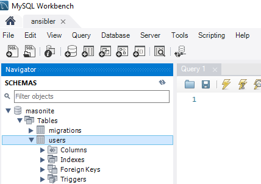

### Setting up MySQl

In this guide you will learn how you can setup MySQL on a CentOS machine and use it with Masonite.


``` bash
sudo su -
yum install wget -y
wget https://dev.mysql.com/get/mysql80-community-release-el7-3.noarch.rpm
rpm -ivh mysql80-community-release-el7-3.noarch.rpm
yum install mysql-server -y 
systemctl start mysqld
systemctl enable mysqld 
```

Then issue the **mysql_secure_installation**

Now we need to create user and allow remote login.

``` bash 
CREATE USER 'root'@'%' identified by 'root';
grant all privileges on *.* to 'root'@'%' WITH GRANT OPTION;
FLUSH PRIVILEGES;
```

We can use [mysql workbench](https://www.mysql.com/downloads/) to test connection and login via a nice console application!.

Open up mysql console and create the **masonite** database.

``` bash
mysql -u root -p
CREATE TABLE masonite;
```

Then you can create your app and create the authentication.

``` bash
mkdir 3
cd 3
craft new
pip install pymysql
```
Edit the **.env** file.

``` bash
DB_HOST=<name of host>
```

Now setup auth and migrate.

``` bash
craft auth
craft migrate
```

After login you have to see something similar.


